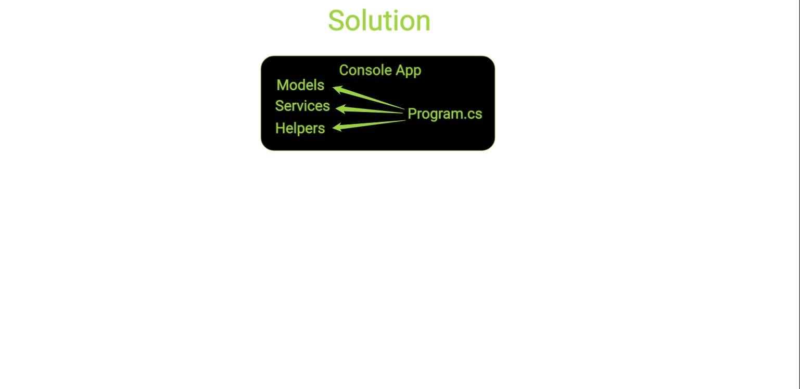
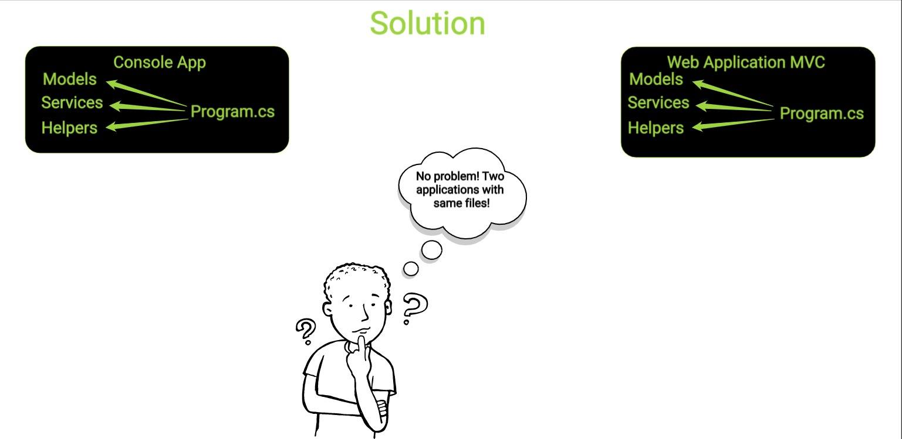
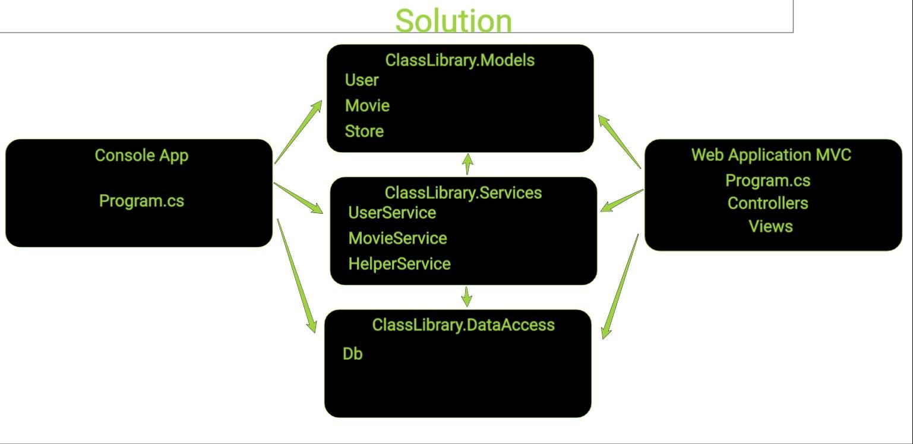

# Building stuff in C# 🏗
## Exception handling 🔹
* When we are building applications, we are bound to hit on an error message or two or maybe even 1000
* This is a common occurence in a development cycle and for that reason, there are systems implemented in the programming languages that handle and manage issues and errors. 
### What are build and runtime errors
* There are two types of errors that we can encounter:
* Build time - Errors that are happening while the application is not running and that prevent the application from starting. Examples: 
  * Syntax errors
  * Type mismatch error
  * Missing refference error
* Runtime errors - Errors that are not expected by the system and that happen while the application is running. Examples: 
  * No reference in a variable, but we try to call a method ( Null reference error )
  * We overflow the value type such as too large number in an integer
  * Issue with parsing 
### What is an Exception in C#
* Exceptions in C# are basically represent the runtime errors in a very descriptive fashion.
* Exception is an object that is filled with information about a runtime error that happened
* We can catch these exceptions as objects and use their properties and methods to better understand what happened
* The Exception class is the main exception class
* We can use this class to create our own errors in the code
* There are also different classes that inherit form Exception and are specific Exceptions for scpecific problems
### How can we handle Exceptions
* Exceptions can be handled by a try catch block
* Try catch block works by waiting for any error happening in the try block
* When an error happens the code in the catch block 
* If we don't have try catch block, the application will stop when an error happens
* If we have an error and we have a try catch block, the application will execute the catch block and continue ( Will not stop completely )
```csharp
try
{
	int input = int.Parse(Console.ReadLine());
}
catch(Exception e)
{
	Console.WriteLine("There was a problem!");
}
finally
{
	Console.WriteLine("Everything is done!");
}
```
### Exception types 
### Handling multiple types of Exceptions at once
* We can handle multiple types of exceptions
* The order of the exceptions is important
* The first catch will try to catch an error
* If it cant it will continue forward
* If no exception is caught we get to the basic Exception and that one catches everything
* Finally block executes always after a try / catch block no matter if there was an error or not
```csharp
try
{
	int input = int.Parse(Console.ReadLine());
}
catch(FormatException e)
{
	Console.WriteLine("WRONG FORMAT! PLEASE ENTER THE RIGHT ONE!");
}
catch(Exception ex)
{
	Console.WriteLine($"ERROR: {ex.Message}");
}
finally
{
	Console.WriteLine("Everything is done!");
}
```
## Class Libraries 🔹
* A project type that can hold classes only
* We can't run a class library project
* We must connect a project that can run to the class library so it can be used
* To connect a project to another one in a Visual Studio solution there needs to be a reference
* Reference to a class library can be added to the project that wants to use that class library
* We can't connect two projects to one another, connection only works one way
* References can't create a chain of projects that creates a circle connecting them one to another as well ( circular reference )
* Class libraries are used to divide our code and create reusable blocks of code or divide the logic to separate projects
* With class libraires we can manage which project uses which data safely
### Example
* We have an appliction in one project with a folder structure dividing our logic

* The client requests another app so we create two application with folder structure 

* But now we have a lot of the logic that is the same for the two projects

* We don't want to have duplicate code so we decide to create a class library and shift our code there
* The code can no be used by any number of projects
* The class library also makes it impossible for any other application to access that logic except the ones that have reference to it

