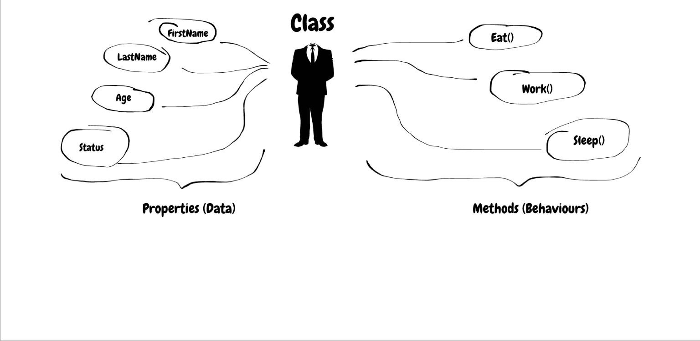
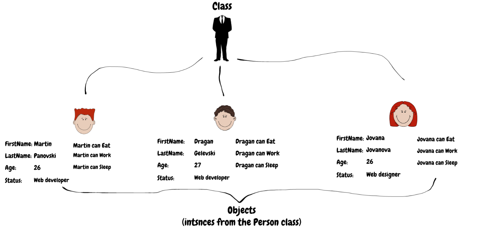

# Getting into Object Oriented Programming ⛵
## What is object oriented programming 🔹
* Object oriented programming is developing application that represents our business logic directly
* This kind of programming should resemble the real world scenarios from our use cases
* That is why all the entities should exist and be connected in a way that make sense in our application as the real world
### What is the goal 
* The goal of OOP is to have an understandable code, code that speaks for itself
* This code can be easy to read for developers that are new or that haven't worked on that piece of code for a while
* Object oriented code also helps with making the code scalable since we build on the business logic from our real world case
* Also every code that looks like the human langauge a bit more, is more readable overall for developers
## Class in C# 🔹
### What is a class
* Class is the main building block in object oriented langauges and in C# in partiular, since it is a language with OOP in mind
* Class is like a schema, that can hold some properties and methods dedicated to it, so that objects can be created from it with those same properties and methods
* This means that when we need values or actions in an object, that object should be created from a class ( From there it will take everything necessary )
* The class is like a plan for building objects, so when we build an object it is almost always from a class
* There are two entities that a class can hold:
  * A property - A value that reflects some unique property for this class ( Only accepts values )
  * A method - Code that can be executed and reflects some unique action for this class ( Only accepts a method )
* These classes can be connected to create a network of code that is connected to each other and make sense as a solution as a whole
* We can even use a class as a type for a method so we have a class that has a property other class, or method that accepts another class etc.
* All of the combinations are done to make the business logic closer from the real world to the code

### Class vs Object
* Class is the plan on how to build something
* Object is the thing that is built 
* The class is the plan on how to build a house
* The object is the house that was built by looking and carefully following the plan ( class )
* We can build 2 houses from the same plan. The only thing different will be the location, the owner etc. but never the structure of the house

### Declaration
* Delaring a class means that we set the plan of what a class should have
* We can't use the class it self in this state to use for values and actions
```csharp
public class Person
{
	public string Name {get;set;}
	public string Age {get;set;}
	private long AccountNumber {get;set;}
	public void Talk(string text){
		Console.WriteLine($"Human {Name} is saying {text}");
	}
}
```
### Instantiation
* This is the way we create new objects from a class
* The new keyword is very important for stating that we are creating a new object of some class
```csharp
Person bob = new Person();
bob.Name = "Bob";
bob.Age = 31;
bob.Talk();
```
```csharp
Person anne = new Person(){
	Name = "Anne",
	Age = 34
};
anne.Talk();
```
### Constructors
* Every class has a special method in the background that's called Constructor
* This method is called every time when an object is created
* We can have multiple constructors in a class if they have different parameters
* Even if we don't write a constructor, the class will call an empty one ( With no parameters )
* If we build a class with our own constructor, we can only build a new object with that constructor
* We can initialize values as constructor parameters so we don't have to enter the values manually
* We can write any code in the constructor as well, such as validations or changing of the values that are entererd
* The brackets in the Instantiation are basically the brackets from the constructor method
```csharp
public class Person
{
	public string Name {get;set;}
	public string Age {get;set;}
	private long AccountNumber {get;set;}
	// Parametarless constructor ( new Person() )
	public Person(){
		AccountNumber = 34235432452;
	}
	// Constructor with parameters ( new Person("Bob", 34) )
	public Person(string name, int age)
	{
		Name = name;
		Age = age;
		AccountNumber = 25325325221;
	}
	public void Talk(string text){
		Console.WriteLine($"Human {Name} is saying {text}");
	}
}
```
```csharp
// Using the first constructor
Person George = new Person();
// Using the second constructor
Person bill = new Person("Bill", 25);
bill.Talk();
```
### Enumerations
* Enumerations are entities that can hold multiple fixed values
* This means that we can't add more or less values or even change the values while the application is running
* It also means that we can use the enum as a value anywhere we need any one value from the set of values from the enum
* Enums are used for concepts that are not changing very often
* They are also used for concepts that we don't want to be changed like type of order
* They can be used for fixed concepts that we know will never change such as days of the week, months, sides of the world etc.
* We don't need instantiation like classes to use enumerations ( We can use them right away )
```csharp
public enum Days 
{
	Monday,
	Tuesday,
	Wednesday,
	Thursday,
	Friday,
	Saturday,
	Sunday
}
```
```csharp
// "today" is some variable of type Days enum that we get from somewhere
if( today == Days.Friday )
{
	Console.WriteLine("PARTY");
}
```
## Inheritance 🔹
### What is the concept of inheritance
* Since we know that OOP should represent real world entities and events, we can find ourselves in a case where some entities depend on others or are part of others
* This means that we need a new way to connect entities that have a more tight connection and involvement to each other
* For that reason we can use one of the main concepts of OOP which is called inheritance
* Inheritance is creating a tree of classes which inherit from one another properties and methods
* There are parent and child classes
  * Parent - The class from which other classes inherit
  * Child - The class that inherits from another class
* Inheritance works by having a parent class share its proeprties and methods to all child classes so they can all use them without declaring them
* In C# a class can inherit from another class ONLY 1 TIME
### Why is inheritance useful
* Inheritance is usefull for creating entities that are general and then more speific ones that share all the properties and methods from the genreal one
* This makes the classes with the same properties and methods, have one central place where their shared properties and methods are stored
* When we change the parent method, the method will be changed for all child classes as well
* It also makes our code cleaner because we no longer have the properties and methods from the parent in our child classes
### Inheritance in C# with classes
```csharp
public class Human
{
    public string Name { get; set; }
    public int Age { get; set; }
    public void PrintInfo()
    {
        Console.WriteLine($"This is {Name} and it's of the age of {Age}.");
    }
}
```
```csharp
public class Programmer : Human
{
    public List<string> ProgrammingLanugages { get; set; }
    public void DevelopApp()
    {
        Console.WriteLine($"The programmer {Name} is developing an app...");
    }
}
```
### Inheritance and constructors
* When inheritance happens, all constructors of the inheritance chain are called ( The child, the parent, the parents parent etc )
* Because they are all called we can also call the parents constructor manually and pass some values to it
* This way the child gets some values and instead of using them all, it can pass some to the parents constructor
```csharp
public class Human
{
    public string Name { get; set; }
    public int Age { get; set; }
    public Human(string name, int age)
    {
		Name = name;
		Age = age;
	}
    public void PrintInfo()
    {
        Console.WriteLine($"This is {Name} and it's of the age of {Age}.");
    }
}
```
```csharp
public class Programmer : Human
{
    public List<string> ProgrammingLanugages { get; set; }
    public Programmer(string name, int age, List<string> languages)
	    : base(name, age)
    {
		ProgrammingLanguages = languages;
	}
    public void DevelopApp()
    {
        Console.WriteLine($"The programmer {Name} is developing an app...");
    }
}
```
### Overriding parent methods
* Methods that parents have can be marked as virtual, meaning that those methods can be changed from the child classes if they so choose
* When a child class wants to change the implementation of some method in the parent and that method is virtual, it just needs to type the method with override keyword
* The child class can change the implementation completly or use the parents functionality and add to it
```csharp
public class Human
{
    public string Name { get; set; }
    public int Age { get; set; }
    public virtual void PrintInfo()
    {
        Console.WriteLine($"This is {Name} and it's of the age of {Age}.");
    }
}
```
```csharp
public class Programmer : Human
{
    public List<string> ProgrammingLanugages { get; set; }
    public void DevelopApp()
    {
        Console.WriteLine($"The programmer {Name} is developing an app...");
    }
    public override void PrintInfo()
    {
        Console.WriteLine($"This is {Name} and these are the programming lanugages they know:");
        foreach (string language in ProgrammingLanugages)
        {
            Console.WriteLine(language);
        }
    }
}
```
